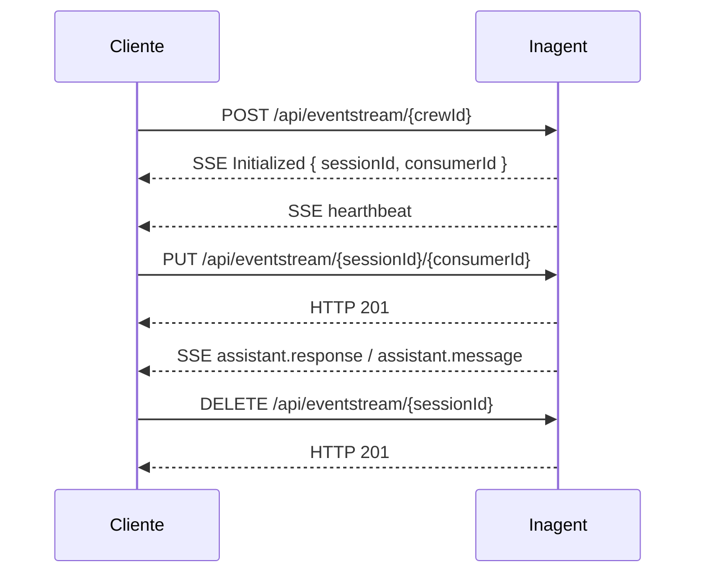

## Visión general

El **Canal API EventStream** permite que aplicaciones externas interactúen con los asistentes de Inagent mediante una API REST. Las respuestas del asistente se reciben por **Server-Sent Events (SSE)**, por lo que el cliente puede procesar mensajes y estados en tiempo real a medida que se generan.

<Callout type="info">
  Usa este canal cuando necesites iniciar sesiones desde una aplicación propia, enviar mensajes a un asistente, escuchar eventos en streaming, reconectarte a una sesión existente o cerrarla desde tu backend.
</Callout>

## Dominios disponibles

| Región | Dominio |
| --- | --- |
| USA | `https://api.backend.us1.inconcert.cloud` |
| Global | `https://api.backend.inconcertcc.com` |

## Base URL

```http
https://{dominio}/assistants-channel/api/v1/channel
```

Ejemplos:

- **USA:** `https://api.backend.us1.inconcert.cloud/assistants-channel/api/v1/channel`
- **Global:** `https://api.backend.inconcertcc.com/assistants-channel/api/v1/channel`

## Autenticación

Todos los endpoints requieren una API Key enviada en el header HTTP `apikey`.

<ParamField header="apikey" type="string" required>
  Clave de acceso proporcionada para tu integración.
</ParamField>

<Warning>
  Las peticiones sin una API Key válida serán rechazadas por el gateway. No incluyas esta credencial en código cliente, repositorios, logs ni ejemplos compartidos.
</Warning>

## Flujo típico



1. Crea la sesión con el endpoint **Init**.
2. Conserva el `sessionId` y el `consumerId` recibidos en el evento `Initialized`.
3. Envía mensajes con **Talk** usando esos identificadores.
4. Procesa la respuesta del asistente desde el stream SSE abierto.
5. Cierra la sesión con **Destroy** cuando termine la conversación.

## Endpoints del canal

<CardGroup cols={2}>
  <Card title="Crear sesión" icon="play" href="/api-reference/endpoints/channel-init">
    Abre una sesión de inferencia y recibe los eventos mediante SSE.
  </Card>
  <Card title="Enviar mensaje" icon="message" href="/api-reference/endpoints/channel-talk">
    Envía texto del usuario a una sesión activa.
  </Card>
  <Card title="Escuchar sesión" icon="radio" href="/api-reference/endpoints/channel-listen">
    Conecta un nuevo consumer al stream de una sesión existente.
  </Card>
  <Card title="Destruir sesión" icon="trash" href="/api-reference/endpoints/channel-destroy">
    Finaliza una sesión activa y cierra sus recursos asociados.
  </Card>
</CardGroup>

## Eventos SSE

Los endpoints **Init** y **Listen** devuelven un stream con `Content-Type: text/event-stream`. Cada evento sigue el formato estándar SSE:

```http
id: 1
event: Initialized
data: {"sessionId":"uuid-de-sesion","consumerId":"uuid-del-consumer"}

id: 2
event: hearthbeat
data: {"minutes":0.5}
```

### Eventos de conexión

| Evento | Descripción | Payload |
| --- | --- | --- |
| `Initialized` | Sesión creada exitosamente. | `{ sessionId: string, consumerId: string }` |
| `hearthbeat` | Señal de vida enviada cada 30 segundos. | `{ minutes: number }` |
| `session.consumer.attached` | Un consumer se conectó a la sesión. | Datos del consumer. |
| `session.consumer.dettached` | Un consumer se desconectó. | Datos del consumer. |
| `reconnect_required` | El servidor necesita cerrar la conexión por reinicio o apagado controlado. | `{ inminentShutdown: true }` |

### Eventos de conversación

| Evento | Descripción |
| --- | --- |
| `user.talk` | Confirmación de que el mensaje del usuario fue recibido. |
| `crew.status.writing` | El asistente está generando una respuesta. |
| `crew.status.waiting` | El asistente terminó de procesar y está esperando input. |
| `assistant.response` | Fragmento parcial de la respuesta del asistente. |
| `assistant.message` | Mensaje completo del asistente. |

### Eventos de herramientas

| Evento | Descripción |
| --- | --- |
| `tool.usage.request` | El asistente solicita ejecutar una herramienta. |
| `tool.usage.result` | Resultado de la ejecución de una herramienta. |
| `tool.usage.error` | Error al ejecutar una herramienta. |

### Eventos de modificadores

| Evento | Descripción |
| --- | --- |
| `crew.modifier.triggered` | Se activó un modificador del crew. |
| `crew.modifier.error` | Error al ejecutar un modificador. |

### Eventos de estado

| Evento | Descripción |
| --- | --- |
| `closed` | La sesión fue cerrada. |
| `error` | Ocurrió un error en la sesión. |

## Reconexión

Si el servidor necesita reiniciarse, enviará el evento `reconnect_required` antes de cerrar la conexión. El cliente puede reconectarse con **Listen** usando el `sessionId` de la sesión previa.

<Tip>
  Conserva el `sessionId` en tu aplicación mientras la conversación esté activa. Esto permite reconectar listeners sin iniciar una sesión nueva.
</Tip>

## Límite de sesiones

El canal aplica control de sesiones simultáneas por tenant. Si se alcanza el límite configurado, el endpoint **Init** responde con `HTTP 429`.

